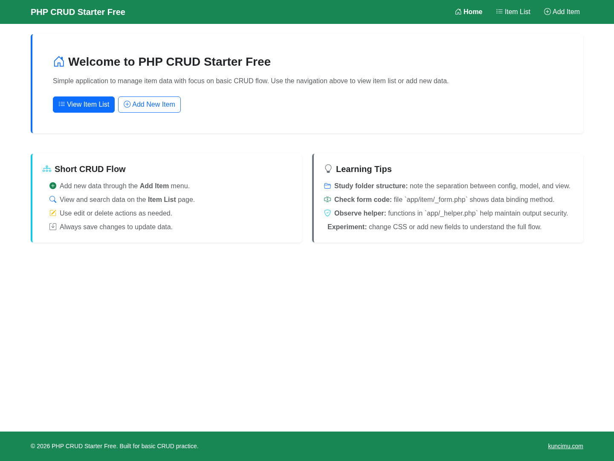
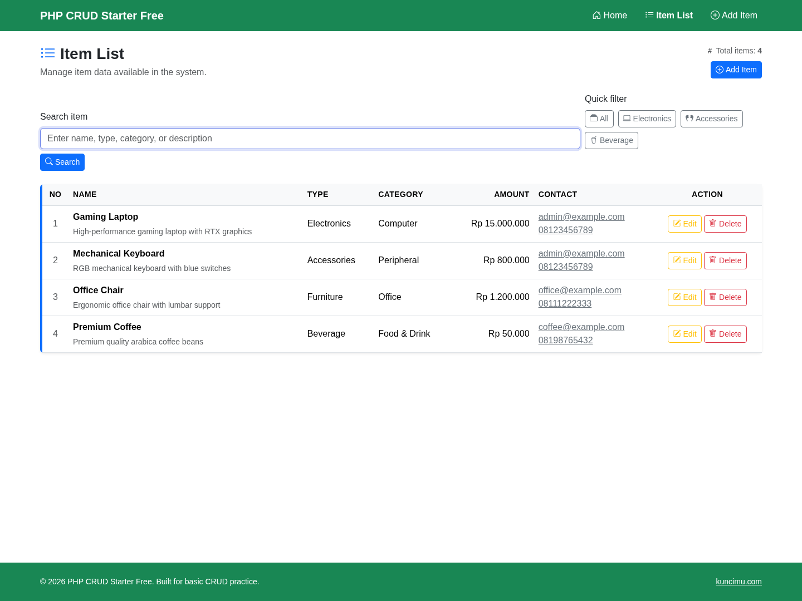
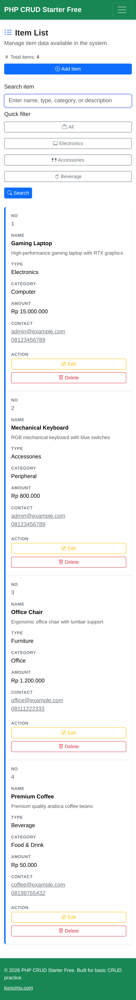
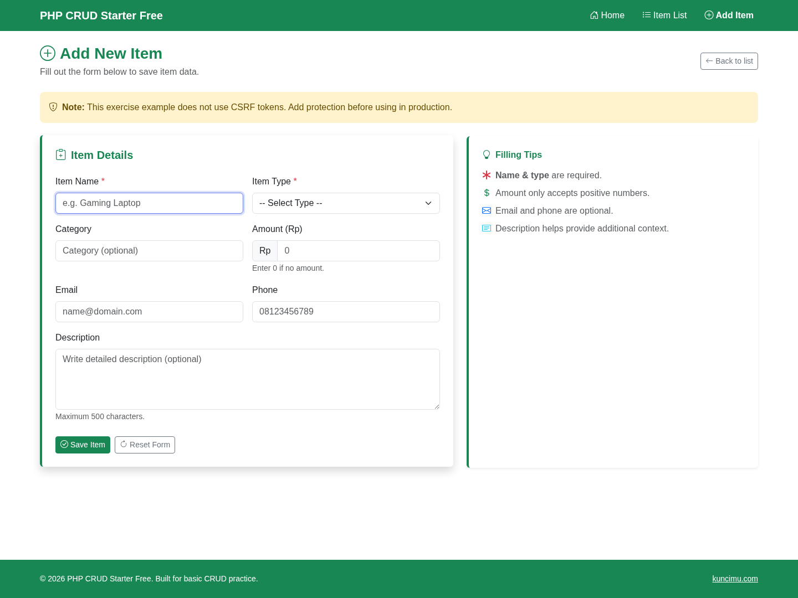

# PHP CRUD Starter Free - Native HTML SQLite

Free donation edition for a simple PHP native CRUD starter. This edition is built for first-time coding learners, new students in months 0-6, and anyone who needs a CRUD example that actually runs.

It is also useful as stable reference code for AI vibe coding: the app already runs, so AI-assisted edits have a concrete baseline to follow.

## Audience

- First-time coding learners.
- New PHP students in the first 0-6 months.
- Beginners who need readable code before learning frameworks.

## Best For

- Learning how a CRUD page connects to a database.
- Running a small Native PHP app without a complex setup.
- Giving an AI coding tool a simple, stable baseline to modify.

## Not For

- Users who need DataTables, CSRF, or a more polished paid starter.
- Junior programmers who already need formal project structure.

## Why This Tier

Free should feel generous, not cheap. It keeps the app small enough to understand, while still proving the full CRUD loop works.

## Why Upgrade

Move to PreBasic when you want offline assets, DataTables, safer form submissions, and more complete documentation.

## Manual Coding Use

Run the app, read one route at a time, edit one form field, then verify the result in the browser.

## AI Vibe Coding Use

Use this edition as the first stable prompt reference. Ask the AI to keep the current route/view style and verify every change with the repo commands.

## Run With Docker

```bash
docker compose up --build
```

Open:

```text
http://localhost:8081
```

## Routes

- Home: `http://localhost:8081/`
- Item list: `http://localhost:8081/?route=item/index`
- Create item: `http://localhost:8081/?route=item/create`

## Screenshots

Full screenshot set: [`docs/screenshots/`](docs/screenshots)

### Home Desktop



### Item List Desktop



### Item List Mobile



### Create Form Desktop



## Metadata

- Slug: `free-native-html-sqlite`
- Tier: `free`
- Backend: `native`
- Frontend: `html`
- Database: `sqlite`
- Runtime: Docker PHP 8.3 Apache
- Distribution: public donation

## Files

- `app/` contains view and model logic.
- `config/` contains env-driven configuration and database setup.
- `public/` is the web root.
- `db/database.sqlite` is the local SQLite database.

## Donation

See `DONATE.md`.

## Verification Commands

From this standalone repository root:

```bash
./scripts/lint.sh
./scripts/smoke.sh
```

To keep the service running after the smoke test:

```bash
./scripts/smoke.sh --keep-up
```
